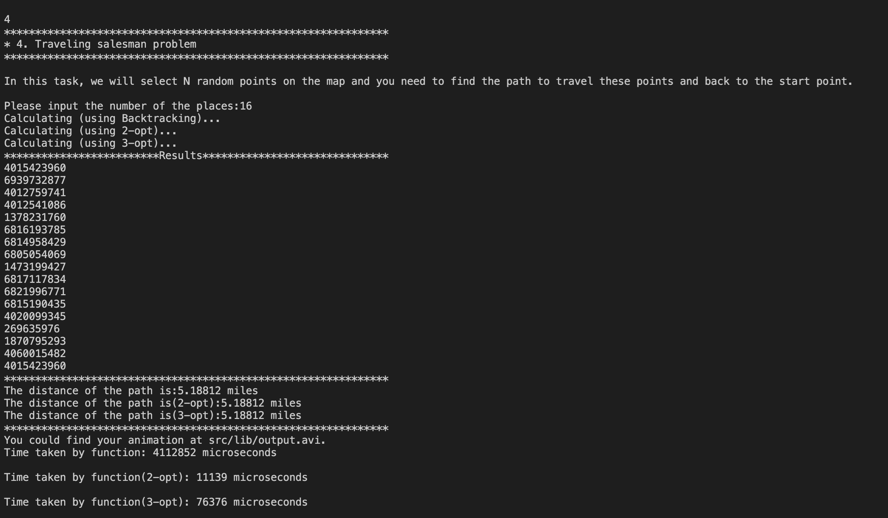
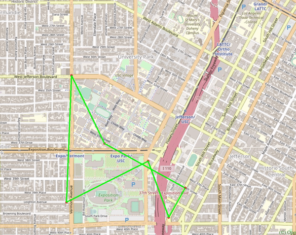
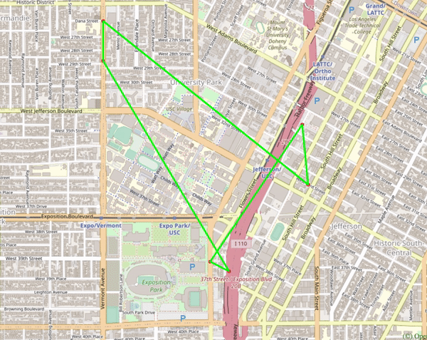
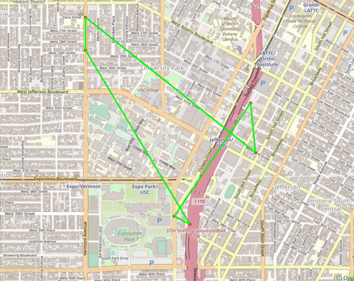
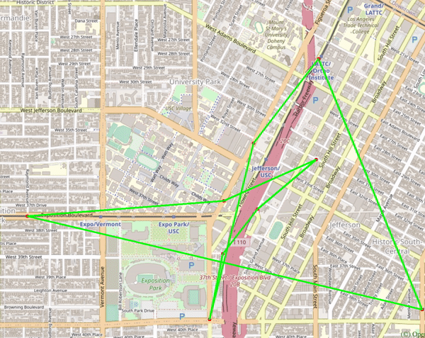
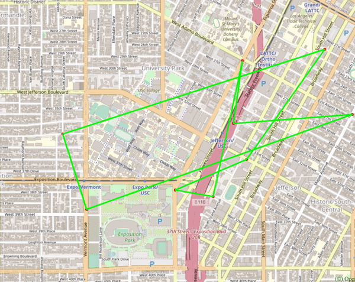
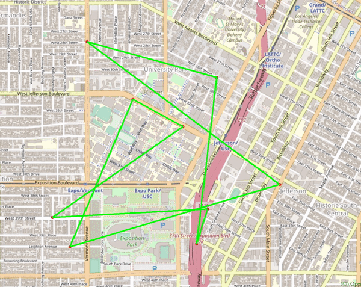
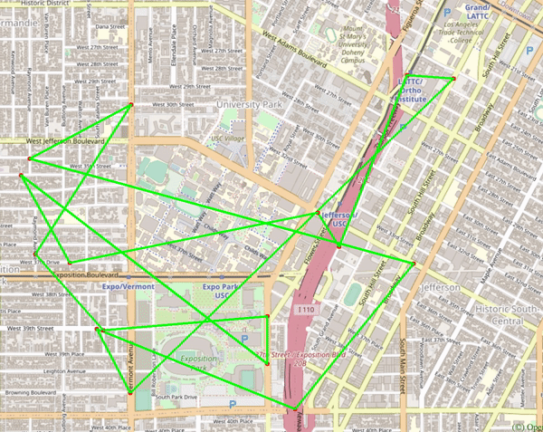
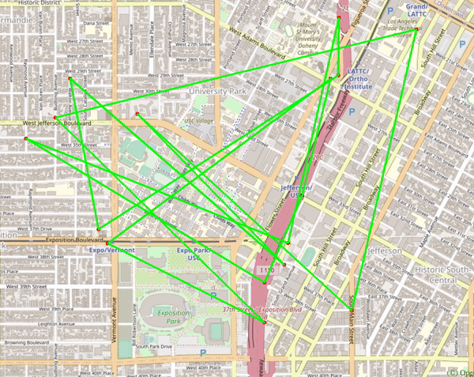
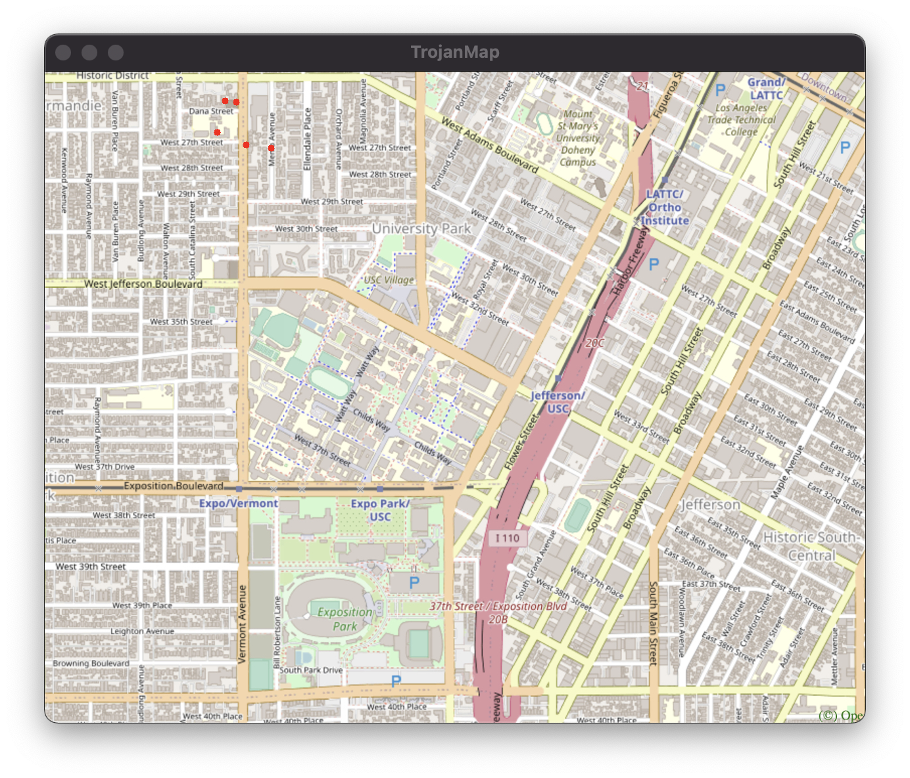

# EE538 Final Project - Fall 2021 - TrojanMap

## Deadline: 

Video Presentation: Friday, December 3 by 2 pm

Code submission: Monday, December 5 by 23:59 pm

## Task List
| Task Name | Functions | Tests |
| :--- | :---: | :---: |
| 1. `Autocomplete` | Done :white_check_mark: | Done :white_check_mark: | 
| 2. `GetPosition` | Done :white_check_mark: | Done :white_check_mark: | 
| 3.1 `CalculateShortestPath_Dijkstra` | Done :white_check_mark: | Done :white_check_mark: | 
| 3.2 `CalculateShortestPath_Bellman_Ford` | Done :white_check_mark: | Done :white_check_mark: | 
| 4.1 `TravellingTrojan` | Done :white_check_mark: | Done :white_check_mark: | 
| 4.2 `TravellingTrojan_2opt` | Done :white_check_mark: | Done :white_check_mark: | 
| 5. `CycleDetection` | Done :white_check_mark: | Done :white_check_mark: | 
| 6. `DeliveringTrojan` | Done :white_check_mark: | Done :white_check_mark: | 
| 7. `FindKClosestPoints` | Done :white_check_mark: | Done :white_check_mark: | 
| 8. `Video presentation and report` | To Be Done :golf: | To Be Added :heavy_exclamation_mark: | 
| 8. `Extra credit items(3-opt)` | Done :white_check_mark: | Done :white_check_mark: | 


## TrojanMap

This project focuses on using data structures in C++ and implementing various graph algorithms to build a map application.

<p align="center"></p>

- Please clone the repository, look through [README.md](README.md) and fill up functions to finish in the project.
- Please make sure that your code can run `bazel run/test`.
- In this project, you will need to fill up [trojanmap.cc](src/lib/trojanmap.cc) and add unit tests in the `tests` directory.

---

## The data Structure

Each point on the map is represented by the class **Node** shown below and defined in [trojanmap.h](src/lib/trojanmap.h).

```cpp
class Node {
  public:
    std::string id;    // A unique id assign to each point
    double lat;        // Latitude
    double lon;        // Longitude
    std::string name;  // Name of the location. E.g. "Bank of America".
    std::vector<std::string>
        neighbors;  // List of the ids of all neighbor points.
};

```

---

## Step 1: Autocomplete the location name

```c++
bool match(std::string str, std::string target); // check if str and target have the same prefix, regardless of whether the letters are uppercase or lowercase
std::vector<std::string> Autocomplete(std::string name); // first discard all the locations whose size is less than name, then do the match() for them
```

We consider the names of nodes as the locations. Implement a method to type the partial name of the location and return a list of possible locations with partial name as prefix. Please treat uppercase and lower case as the same character.

<p align="center"></p>
<p align="center"></p>
<p align="center"></p>


## Step 2: Find the place's Coordinates in the Map

```c++
std::pair<double, double> GetPosition(std::string name);
```

Given a location name, return the latitude and longitude. There are no duplicated location names. You should mark the given locations on the map. If the location does not exist, return (-1, -1).


<p align="center"></p>

## Step 3: CalculateShortestPath between two places

```c++
std::vector<std::string> CalculateShortestPath_Dijkstra(std::string &location1_name,
                                               std::string &location2_name);
std::vector<std::string> CalculateShortestPath_Bellman_Ford(std::string &location1_name,
                                               std::string &location2_name);
```

Given 2 locations A and B, find the best route from A to B. The distance between 2 points is the euclidean distance using latitude and longitude. You should use both Dijkstra algorithm and Bellman-Ford algorithm. Compare the time for the different methods. Show the routes on the map. If there is no path, please return empty vector.

Please report and compare the time spent by these 2 algorithms.


<p align="center"></p>

## Step 4: The Traveling Trojan Problem (AKA Traveling Salesman!)

In this section, we assume that a complete graph is given to you. That means each node is a neighbor of all other nodes.
Given a vector of location ids, assume every location can reach all other locations in the vector (i.e. assume that the vector of location ids is a complete graph).
Find the shortest route that covers all the locations exactly once and goes back to the start point. 

You will need to return the progress to get the shortest route which will then be converted to an animation.  

We will use the following algorithms:

- Backtracking
```c++
std::vector<std::vector<double>> CreateAdjMatrix(std::vector<std::string> &location_ids); // create the weights matrix for all locations
void Backtracking(...); // do the backtracking to get the optimal result, and every time getting a shorter path, push it in paths, the detailed parameters are shown in the following diagram
std::pair<double, std::vector<std::vector<std::string>>> TravellingTrojan(
      std::vector<std::string> &location_ids);
```
### Parameters List ("shorter" in the diagram means less cost)
| Parameter Name | Meaning |
| :--- | :--- |
| `const std::vector<std::vector<double>> &adjacent_matrix` | Store the distance weight between all points |
| `std::vector<std::vector<std::string>> &paths` | Store every shorter path |
| `std::vector<std::string> &path` | Store current path |
| `std::vector<bool> &visit` | Check if a location is visited |
| `double &mincost` | Store the cost of the shortest path |
| `double cost` | Store the cost of current path |
| `int current` | Store the index of current location |
| `const std::vector<std::string> &location_ids` | The input vector to map location's index to its id |
| `std::unordered_map<std::string, int> &id2index` | A unordered_map to map location's id to its index |

- [2-opt Heuristic](https://en.wikipedia.org/wiki/2-opt). Also see [this paper](http://cs.indstate.edu/~zeeshan/aman.pdf)
```c++
// Calculate the distance for each adjusted path
double CalculatePathDis(const std::vector<std::vector<double>> &adjacent_matrix, std::unordered_map<std::string, int> &id2index, std::vector<std::string> &path);
std::pair<double, std::vector<std::vector<std::string>>> TravellingTrojan_2opt(
      std::vector<std::string> &location_ids);
```

Please report and compare the time spent by these 2 algorithms. 2-opt algorithm may not get the optimal solution. Please show how far your solution is from the optimal solution.

Show the routes on the map. For each intermediate solution, create a new plot. Your final video presentation should include the changes to your solution.

We will randomly select N points in the map and run your program.

Case 1: 6 locations
For a few locations, all the 3 methods can find the optimal result in an acceptable time. These two heuristic algorithms have not been able to show their advantages in time consumption.
<p align="center"></p>
<p align="center"></p>

Case 2: 9 locations
When the locations become more, 2-opt failed to get the optimal result, but saved a lot of time compared to the backtracking. 3-opt still can get the optimal result, while cost slightly more time than 2-opt.
<p align="center"></p>
<p align="center"></p>


Case 3: 16 locations
At this case, the time cost by backtracking is gradually unacceptable, the two heuristic algorithms can dramatically decrease the time consumption，and the results only have an error of less than 10% and 5% respectively.
<p align="center"></p>
<p align="center"></p>

||||
| :---: | :---: | :---: |
| `Backtracking` | `2-opt` | `3-opt` |
|  |  |  |
|  |  |  |
|  |  |  |


## Step 5: Cycle Detection

```c++
bool CycleDetection(std::vector<double> &square);
```

In this section, we use a square-shaped subgraph of the original graph by using four coordinates stored in ```std::vector<double> square```, which follows the order of left, right, upper, and lower bounds. 

Then try to determine if there is a cycle path in the that subgraph. If it does, return true and report that path on the map. Otherwise return false.

Example 1:
```shell
Input: square = {-118.299, -118.264, 34.032, 34.011}
Output: true
```
Here we use the whole original graph as our subgraph. 
<p align="center"></p>

Example 2:
```shell
Input: square = {-118.290919, -118.282911, 34.02235, 34.019675}
Output: false
```
Here we use a square area inside USC campus as our subgraph
<p align="center"></p>

Note: You could use the function below to visualize the subgraph. 

```c++
/**
 * PlotPoints: Given a vector of location ids draws the points on the map (no path).
 * 
 * @param  {std::vector<std::string>} location_ids : points inside square
 * @param  {std::vector<double>} square : boundary
 */
void TrojanMap::PlotPointsandEdges(std::vector<std::string> &location_ids, std::vector<double> &square)
```

## Step 6: Topological Sort

```c++
std::vector<std::string> DeliveringTrojan(std::vector<std::string> &location_names,
                                            std::vector<std::vector<std::string>> &dependencies);
```

Tommy Trojan got a part-time job from TrojanEats, for which he needs to pick up and deliver food from local restaurants to various location near the campus. Tommy needs to visit a few different location near the campus with certain order, since there are some constraints. For example, he must first get the food from the restaurant before arriving at the delivery point. 

The TrojanEats app will have some instructions about these constraints. So, Tommy asks you to help him figure out the feasible route!

Here we will give you a vector of location names that Tommy needs to visit, and also some dependencies between those locations.


Case 1: 4 locations
<p align="center"></p>
<p align="center"></p>
Case 2: 7 locations
<p align="center"></p>
<p align="center"></p>
Case 3: 12 locations
<p align="center"></p>
<p align="center"></p>


## Step 7: Find K closest points

Given a location name and a integer k , find the k closest locations with name on the map and return a vector of string ids. 

We will use the following algorithms:

- Backtracking
```c++
std::vector<std::string> FindKClosestPoints(std::string name, int k);
```

Please report and compare the time spent by this algorithm and show the points on the map.


<p align="center"></p>


### Report:

Your README file should include two sections:

1. High-level overview of your design (Use diagrams and pictures for your data structures).
2. Detailed description of each function and its time complexity.
3. Time spent for each function.
4. Discussion, conclusion, and lessons learned.
