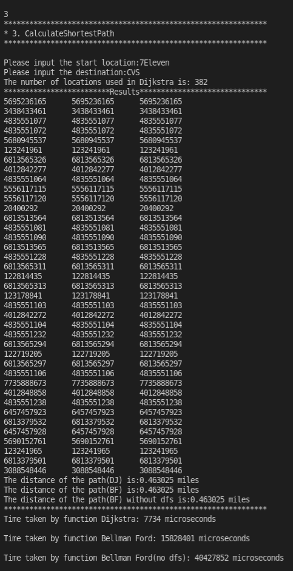

# EE538 Final Project - Fall 2021 - TrojanMap

## Deadline: 

Video Presentation: Friday, December 3 by 2 pm

Code submission: Monday, December 5 by 23:59 pm

## Task List
| Task Name | Functions | Tests |
| :--- | :---: | :---: |
| 1. `Autocomplete` | Done :white_check_mark: | Done :white_check_mark: | 
| 2. `GetPosition` | Done :white_check_mark: | Done :white_check_mark: | 
| 3.1 `CalculateShortestPath_Dijkstra` | Done :white_check_mark: | Done :white_check_mark: | 
| 3.2 `CalculateShortestPath_Bellman_Ford` | Done :white_check_mark: | Done :white_check_mark: | 
| 4.1 `TravellingTrojan` | Done :white_check_mark: | Done :white_check_mark: | 
| 4.2 `TravellingTrojan_2opt` | Done :white_check_mark: | Done :white_check_mark: | 
| 5. `CycleDetection` | Done :white_check_mark: | Done :white_check_mark: | 
| 6. `DeliveringTrojan` | Done :white_check_mark: | Done :white_check_mark: | 
| 7. `FindKClosestPoints` | Done :white_check_mark: | Done :white_check_mark: | 
| 8. `Video presentation and report` | To Be Done :golf: | To Be Added :heavy_exclamation_mark: | 
| 8. `Extra credit items(3-opt)` | Done :white_check_mark: | Done :white_check_mark: | 


## TrojanMap

This project focuses on using data structures in C++ and implementing various graph algorithms to build a map application.

<p align="center"></p>

- Please clone the repository, look through [README.md](README.md) and fill up functions to finish in the project.
- Please make sure that your code can run `bazel run/test`.
- In this project, you will need to fill up [trojanmap.cc](src/lib/trojanmap.cc) and add unit tests in the `tests` directory.

---

## The data Structure

Each point on the map is represented by the class **Node** shown below and defined in [trojanmap.h](src/lib/trojanmap.h).

```cpp
class Node {
  public:
    std::string id;    // A unique id assign to each point
    double lat;        // Latitude
    double lon;        // Longitude
    std::string name;  // Name of the location. E.g. "Bank of America".
    std::vector<std::string>
        neighbors;  // List of the ids of all neighbor points.
};

```
Establish a new data structure class **DJNode** shown below and defined in [trojanmap.h]
DJNode have two parameter, the first is the id of the node, the second is a ``double`` type dist.
DJNode will be used by **CalculateShortestPath_Dijkstra** to calculate the shortest path and 
**FindKClosestPoints** to find the find the Kth closest points.
```cpp
class DJNode{
  public:
  std::string id;
  double dist;
  DJNode(){};
  DJNode(const DJNode &n):id(n.id), dist(n.dist){}
  DJNode(std::string id, double dist=std::numeric_limits<double>::max()): id(id),dist(dist){}
  DJNode &operator=(const DJNode&n){
    if(this==&n) return *this;
    this->id=n.id;
    this->dist=n.dist;
    return *this;
  }
};

```
Given node's id, all the information of node could be obtained through **data**; In order to find the id of the node, using **name2id**.
```cpp
  std::unordered_map<std::string, Node> data;
  std::unordered_map<std::string, std::string> name2id;
```

---

## Step 1: Autocomplete the location name

```c++
bool match(std::string str, std::string target); // check if str and target have the same prefix, regardless of whether the letters are uppercase or lowercase
std::vector<std::string> Autocomplete(std::string name); // first discard all the locations whose size is less than name, then do the match() for them
```

We consider the names of nodes as the locations. Implement a method to type the partial name of the location and return a list of possible locations with partial name as prefix. Please treat uppercase and lower case as the same character.

<p align="center"></p>
<p align="center"></p>
<p align="center"></p>

### Time complexity: 
Let n be the length of name, m be the number of all locations, ```match``` need to check every character in target(name), so it is O(n), and we need to apply ```match``` to every locations, so the totally time complexity is O(n*m).  
PS: The longer the name, the less locatins need to be chech in ```match``` , the shorter the time it takes.

## Step 2: Find the place's Coordinates in the Map

```c++
std::pair<double, double> GetPosition(std::string name);
std::string TrojanMap::GetID(std::string name);
```

Given a location name, in order to find the information of the node, find the id of the node first by using function `std::string TrojanMap::GetID(std::string name)`, then all the information of the node could be knew through ``std::unordered_map<std::string, Node> data`` Return the latitude and longitude. If could not find ID, return (-1, -1).


<p align="center"></p>
<p align="center"></p>
<p align="center"></p>
<p align="center"></p>
<p align="center"></p>
<p align="center"></p>

## Step 3: CalculateShortestPath between two places

```c++
std::vector<std::string> CalculateShortestPath_Dijkstra(std::string &location1_name,
                                               std::string &location2_name);
std::vector<std::string> CalculateShortestPath_Bellman_Ford(std::string &location1_name,
                                               std::string &location2_name);
void Bellman_dfs(std::string u,std::unordered_map<std::string,bool>&visited,
                 std::unordered_map<std::string,std::unordered_map<std::string,double>>&mp);
```

Given 2 locations A and B, find the best route from A to B.(A is src location and B is dst location) The distance between 2 points is the euclidean distance using latitude and longitude. Use both Dijkstra algorithm and Bellman-Ford algorithm. Compare the time for the different methods. Show the routes on the map. If there is no path, please return empty vector.


### Parameters List1 (CalculateShortestPath_Dijkstra)
| Parameter Name | Meaning |
| :--- | :--- |
| `std::vector<std::string> path` | Store the final shortest path|
| `std::unordered_map<std::string,double> dist` | key: node ; val: the shortest distance from the node to the src |
| `std::unordered_map<std::string,std::string>prev` | key: the node ; val is the prev node |
| `std::unordered_set<std::string> visited;` | store the shortest distance node in visited |
| `std::priority_queue<DJNode,std::vector<DJNode>, decltype(compare)> dist_heap(compare)` | using a heap to sort the node in the graph |

### Parameters List2 (CalculateShortestPath_Bellman_Ford)
| Parameter Name | Meaning |
| :--- | :--- |
| `std::vector<std::string> path` | Store the final shortest path|
| ` std::unordered_map<std::string,bool> visited` | store the node visited in DFS|
| `std::unordered_map<std::string,std::unordered_map<std::string,double>>mp` | use DFS iterate the graph, store the relationship of nodes in the graph |
| `std::unordered_map<std::string,double> distance` | key: node ; val: the shortest distance from the node to the src |
| `std::unordered_map<std::string,std::string>prev` | key: the node ; val is the prev node |

### Runtime Comparison
| NO. | Src Loc | Dst Loc | Dist(miles) | DJ-runtime(usec)| BF-runtime(usec) |
| :--- | :--- | :--- | :--- | :--- | :--- |
| 0 | 7Eleven |  Popeyes Louisiana Kitchen| 0.107757 | 489 | 15,032,881 |
| 1 | Tap Two Blue | 7Eleven | 0.259747 | 994 | 14,186068 |
| 2 | CVS | Target | 0.351751 | 1,844 | 14,708,495 |
| 3 | 7Eleven | CVS | 0.463025 | 4,338 | 13,974,720 |
| 4 | Tap Two Blue | CVS | 0.684286 | 4,782 | 14,463,257 |
| 5 | 7Eleven | Target | 0.788389 | 7,976 | 15,537,051 |
| 6 | Target | Ralphs | 0.839235 | 21,308 | 14,822,822 |
| 7 | Ralphs | CVS | 1.14497 | 9,330 | 14,655,557 |
| 8 | Ralphs | 7Eleven | 1.3303 | 14,042 | 15,988,243 |
| 9 | Metro 40 | Driveway | 1.77417 | 54,777 | 15,715,079 |

From the table above, we could found that the speed of Dijkstra is exceeded Bellman Ford to great extent. That is because Bellman ford need to iterate each node in the data using DFS to find the graph. However, Dijstra doesn't need to do that. Dijstra using priority_queue to find the shortest distance, it only need to sort the relevant node.

### Time Complxity
CalculateShortestPath_Dijkstra: O(m+nlogn)

CalculateShortestPath_Bellman_Ford: O(m*n)

### Sample Sreenshot
<p align="center"></p>
<p align="center"></p>
<p align="center"></p>
<p align="center"></p>
<p align="center"></p>
<p align="center"></p>

## Step 4: The Traveling Trojan Problem (AKA Traveling Salesman!)

In this section, we assume that a complete graph is given to you. That means each node is a neighbor of all other nodes.
Given a vector of location ids, assume every location can reach all other locations in the vector (i.e. assume that the vector of location ids is a complete graph).
Find the shortest route that covers all the locations exactly once and goes back to the start point. 

You will need to return the progress to get the shortest route which will then be converted to an animation.  

We will use the following algorithms:

- Backtracking
```c++
std::vector<std::vector<double>> CreateAdjMatrix(std::vector<std::string> &location_ids); // create the weights matrix for all locations
void Backtracking(...); // do the backtracking to get the optimal result, and every time getting a shorter path, push it in paths, the detailed parameters are shown in the following diagram
std::pair<double, std::vector<std::vector<std::string>>> TravellingTrojan(std::vector<std::string> &location_ids);
```
### Parameters List ("shorter" in the diagram means less cost)
| Parameter Name | Meaning |
| :--- | :--- |
| `const std::vector<std::vector<double>> &adjacent_matrix` | Store the distance weight between all points |
| `std::vector<std::vector<std::string>> &paths` | Store every shorter path |
| `std::vector<std::string> &path` | Store current path |
| `std::vector<bool> &visit` | Check if a location is visited |
| `double &mincost` | Store the cost of the shortest path |
| `double cost` | Store the cost of current path |
| `int current` | Store the index of current location |
| `const std::vector<std::string> &location_ids` | The input vector to map location's index to its id |
| `std::unordered_map<std::string, int> &id2index` | A unordered_map to map location's id to its index |

- [2-opt Heuristic](https://en.wikipedia.org/wiki/2-opt). Also see [this paper](http://cs.indstate.edu/~zeeshan/aman.pdf)
```c++
// Calculate the distance for each adjusted path
double CalculatePathDis(const std::vector<std::vector<double>> &adjacent_matrix, std::unordered_map<std::string, int> &id2index, std::vector<std::string> &path);
// 1. Starting from the default path, 
// 2. randomly exchange two points to check whether the distance becomes shorter, 
// 3. if so, counter = 0, if not, counter is increased by one, 
// 4. repeat 2,3 until the counter == the maximum number of iterations
std::pair<double, std::vector<std::vector<std::string>>> TravellingTrojan_2opt(std::vector<std::string> &location_ids); 
void TrojanMap::TPS_2opt(const std::vector<std::vector<double>> &adjacent_matrix, 
                        double &mincost, std::vector<std::vector<std::string>> &paths, 
                        std::vector<std::string> &path_start, std::unordered_map<std::string, int> &id2index);
// Similar to 2-opt, but in 3-opt, you need to choose 3 points randomly, and have 7 way to change the path, and 3 of them are the same as 2-opt, so apply the left 4 ways in 3-opt
std::pair<double, std::vector<std::vector<std::string>>> TrojanMap::TravellingTrojan_3opt(std::vector<std::string> &location_ids);
void TrojanMap::TPS_3opt(const std::vector<std::vector<double>> &adjacent_matrix, 
                        double &mincost, std::vector<std::vector<std::string>> &paths, 
                        std::vector<std::string> &path_start, std::unordered_map<std::string, int> &id2index);
// key of 3-opt:
  // a = [end, start - 1], b = [start, mid - 1], c = [mid, end - 1]
  // a' means reverse a, especially reverse a == reverse(b+c) = c'b'
  // 1. ab'c'
  std::reverse(path_copys[0].begin() + start, path_copys[0].begin() + mid);
  std::reverse(path_copys[0].begin() + mid , path_copys[0].begin() + end);
  // 2. a'b'c
  std::reverse(path_copys[1].begin() + start, path_copys[1].begin() + end);
  std::reverse(path_copys[1].begin() + start, path_copys[1].begin() + mid);
  // 3. a'bc'
  std::reverse(path_copys[2].begin() + start, path_copys[2].begin() + end);
  std::reverse(path_copys[2].begin() + mid, path_copys[2].begin() + end);
  // 4. a'b'c'
  std::reverse(path_copys[3].begin() + start, path_copys[3].begin() + end);
  std::reverse(path_copys[3].begin() + start, path_copys[3].begin() + mid);
  std::reverse(path_copys[3].begin() + mid, path_copys[3].begin() + end);
```

Please report and compare the time spent by these 2 algorithms. 2-opt algorithm may not get the optimal solution. Please show how far your solution is from the optimal solution.

Show the routes on the map. For each intermediate solution, create a new plot. Your final video presentation should include the changes to your solution.

We will randomly select N points in the map and run your program.

Case 1: 6 locations
For a few locations, all the 3 methods can find the optimal result in an acceptable time. These two heuristic algorithms have to do some redundant iterators, so in this case they cost more time than Backtracking.
<p align="center"></p>
<p align="center"></p>

Case 2: 9 locations
When the locations become more, the time increase of Backtracking is greater than 2-opt and 3-opt, the time cost by these 3 algorithms is silimar.
<p align="center"></p>
<p align="center"></p>

Case 3: 12 locations
When the locations become more, 2-opt and 3-opt gradually show their advantages in time consumption. And sometimes, 2-opt/3-opt would not get the optimal results.
<p align="center"></p>
<p align="center"></p>

Case 4: 16 locations
At this case, the time cost by backtracking is gradually unacceptable, the two heuristic algorithms can dramatically decrease the time consumption，and can get the same or very close results.
<p align="center"></p>
<p align="center"></p>

| `Backtracking` | `2-opt` | `3-opt` |
| :---: | :---: | :---: |
|  |  |  |
|  |  |  |
|  |  |  |
|  |  |  |

| # of the places | dis(Backtracking) | time(Backtracking) | dis(2-opt) | time(2-opt) | dis(3-opt) | time(3-opt) |
| :---: | :---: | :---: | :---: | :---: | :---: | :---: |
| 4 | 2.33288 | 43 | 2.33288 | 169 | 2.33288 | 62 |
| 5 | 2.84035 | 50 | 2.84035 | 424 | 2.84035 | 211 |
| 6 | 3.96888 | 115 | 3.96888 | 915 | 3.96888 | 666 |
| 6 | 2.92648 | 96 | 2.92648 | 579 | 2.92648 | 425 |
| 7 | 3.2894 | 278 | 3.2894 | 1393 | 3.2894 | 1511 |
| 8 | 3.34032 | 1043 | 3.34032 | 2145 | 3.34032 | 2154 |
| 9 | 5.19646 | 3324 | 5.5148 | 2863 | 4.71893 | 3854 |
| 9 | 4.29746 | 3332 | 4.29746 | 2102 | 4.29746 | 2938 |
| 10 | 4.75803 | 13757  | 4.75803 | 3594 | 4.75803 | 5126 |
| 11 | 5.72452 | 71818 | 6.23207 | 2995 | 5.72452 | 6291 |
| 12 | 4.6685 | 98647 | 4.6685 | 4837 | 4.6685 | 21344 |
| 12 | 4.76991 | 149328 | 4.9068 | 4222 | 4.76991 | 6939 |
| 12 | 3.93467 | 30824 | 3.93467 | 5961 | 3.93467 | 11926 |
| 12 | 5.08785 | 67933 | 5.16168 | 4860 | 5.08785 | 8823 |
| 13 | 5.04915 | 523515 | 5.08812 | 5991 | 5.04915 | 10451 |
| 14 | 4.63693 | 976212 | 4.63693 | 7058 | 4.63693 | 42052 |
| 15 | 5.31136 | 66687483 | 5.31137 | 8529 | 5.31136 | 31505 |
| 16 | 5.49701 | 174477497 | 5.52954 | 12596 | 5.49701 | 76929 |
| 16 | 5.18812 | 4112852 | 5.18812 | 11139 | 5.18812 | 76376 |


### Runtime Comparison
When the number of locations is larger than 13, the time cost by Backtracking is more than 50 times than 2-opt, while 2-opt/3-opt can have very close or the same results.
In addition, from the last two cases, we can find the early break can decrease dramatically the time in some special cases. 2-opt and 3-opt would not have some obvious change for the same scale cases.

### Time complexity
Let n be the number of the locations. 
1. For the Backtracking, we need to iterate every path, so it is O(n!), while in fact, due to the early break, the time it cost practically would be less than O(n!);
2. Let the maximum number of iterations be K, for every iteration, we have O(n^2) ways to choose two locations to reverse the path, so the whole time complexity is (K*n^2). In practical, I set K = n;
3. Similarly to 2-opt, for every iteration, we have O(n^3) ways to choose three locations to change the path in 4 pattern, so the whole time complexity is (K*n^3). In practical, I set K = 1. 


## Step 5: Cycle Detection

```c++
bool CycleDetection(std::vector<double> &square);
//using DFS to find cycle
bool IsCyclicUtil(std::string node,std::map<std::string,bool>&isvisited,
        std::string parent,std::unordered_map<std::string,std::vector<std::string>> adj);
```

In this section, we use a square-shaped subgraph of the original graph by using four coordinates stored in ```std::vector<double> square```, which follows the order of left, right, upper, and lower bounds.
Firstly, we iterate the  ```data``` to find out all the node inside the 
```std::vector<double> square```, and establish a map to store the node and its neighbors
```std::unordered_map<std::string,std::vector<std::string>> adj```
Then using DFS to find is there remains a cycle, call the recursive function ```IsCyclicUtil()```
If there is a cycle return true, and  path will appears on the map. Otherwise return false.

Cases:

### Time complexity: 
iterate the data O(n), DFS recursive 0(n+m);
Total complexity: O(n^2);


## Step 6: Topological Sort

```c++
std::vector<std::string> DeliveringTrojan(std::vector<std::string> &location_names,
                                            std::vector<std::vector<std::string>> &dependencies);
```

Tommy Trojan got a part-time job from TrojanEats, for which he needs to pick up and deliver food from local restaurants to various location near the campus. Tommy needs to visit a few different location near the campus with certain order, since there are some constraints. For example, he must first get the food from the restaurant before arriving at the delivery point. 

The TrojanEats app will have some instructions about these constraints. So, Tommy asks you to help him figure out the feasible route!

Here we will give you a vector of location names that Tommy needs to visit, and also some dependencies between those locations.


Case 1: 4 locations
<p align="center"></p>
<p align="center"></p>
Case 2: 7 locations
<p align="center"></p>
<p align="center"></p>
Case 3: 12 locations
<p align="center"></p>
<p align="center"></p>

### Time complexity
Let V be the number of locations, E be the number of dependencies. Because it just is similar to the DFS, and I use a adjencent list(map) to store all the edge, so the time complexity is O(V+E)


## Step 7: Find K closest points

Given a location name and a integer k , find the k closest locations with name on the map and return a vector of string ids. 

We will use the following algorithms:

- Heap Sort
```c++
std::vector<std::string> FindKClosestPoints(std::string name, int k);
```
In this function, we will use the data stureture DJNode again to establish the priority_queue, to
sort the distance from the from to each node in the map.
```c++
  auto compare=[](DJNode a,DJNode b){return a.dist > b.dist;};
  std::priority_queue<DJNode,std::vector<DJNode>,decltype(compare)> dist_heap(compare); 
```
Cases:

### Time complexity:
Firstly, using a for loop to iterate the `data` to calculate the distance between each node and the source O(n);
Then push the node into priority_queue to sort the nodes O(nlogn);
Total O(n^2 logn);


### Report:

Your README file should include two sections:

1. High-level overview of your design (Use diagrams and pictures for your data structures).
2. Detailed description of each function and its time complexity.
3. Time spent for each function.
4. Discussion, conclusion, and lessons learned.
