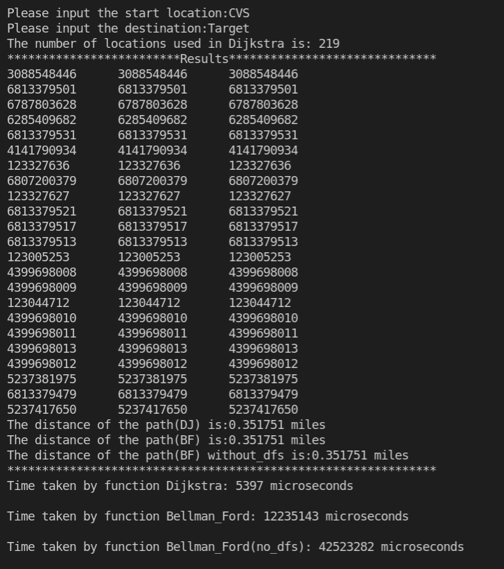
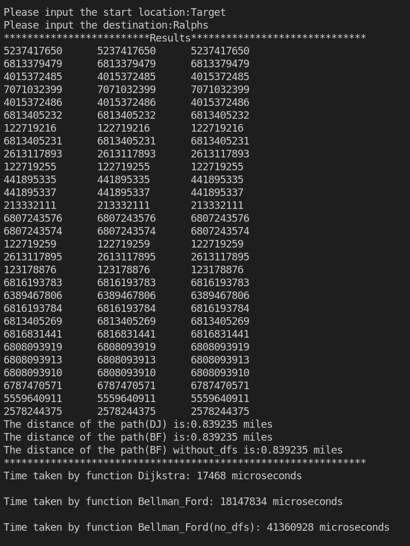
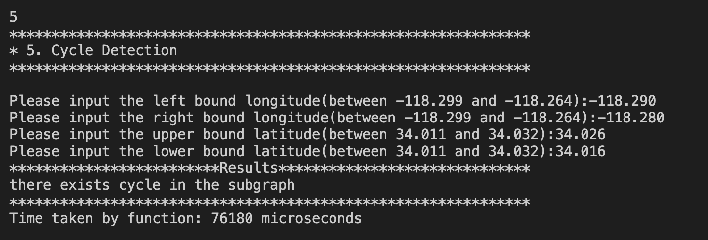
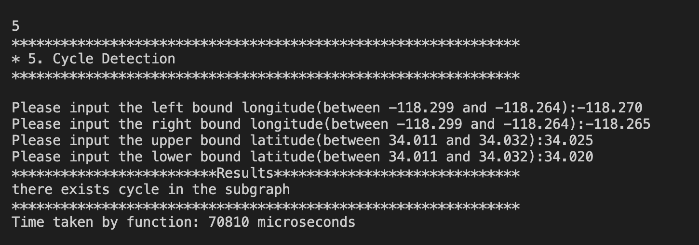
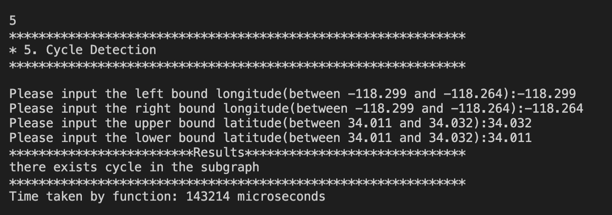
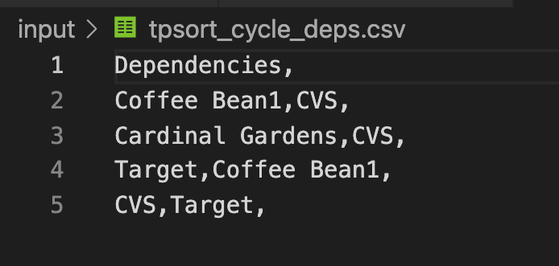

# EE538 Final Project - Fall 2021 - TrojanMap

## Deadline: 

Video Presentation: Friday, December 3 by 2 pm

Code submission: Monday, December 5 by 23:59 pm

## Task List
| Task Name | Functions | Tests |
| :--- | :---: | :---: |
| 1. `Autocomplete` | Done :white_check_mark: | Done :white_check_mark: | 
| 2. `GetPosition` | Done :white_check_mark: | Done :white_check_mark: | 
| 3.1 `CalculateShortestPath_Dijkstra` | Done :white_check_mark: | Done :white_check_mark: | 
| 3.2 `CalculateShortestPath_Bellman_Ford` | Done :white_check_mark: | Done :white_check_mark: | 
| 4.1 `TravellingTrojan` | Done :white_check_mark: | Done :white_check_mark: | 
| 4.2 `TravellingTrojan_2opt` | Done :white_check_mark: | Done :white_check_mark: | 
| 5. `CycleDetection` | Done :white_check_mark: | Done :white_check_mark: | 
| 6. `DeliveringTrojan` | Done :white_check_mark: | Done :white_check_mark: | 
| 7. `FindKClosestPoints` | Done :white_check_mark: | Done :white_check_mark: | 
| 8. `Video presentation and report` | Done :white_check_mark: | Done :white_check_mark: | 
| 8. `Extra credit items(3-opt)` | Done :white_check_mark: | Done :white_check_mark: | 


## TrojanMap

This project focuses on using data structures in C++ and implementing various graph algorithms to build a map application.

<p align="center"></p>

- Please clone the repository, look through [README.md](README.md) and fill up functions to finish in the project.
- Please make sure that your code can run `bazel run/test`.
- In this project, you will need to fill up [trojanmap.cc](src/lib/trojanmap.cc) and add unit tests in the `tests` directory.

---

## The data Structure

Each point on the map is represented by the class **Node** shown below and defined in [trojanmap.h](src/lib/trojanmap.h).

```cpp
class Node {
  public:
    std::string id;    // A unique id assign to each point
    double lat;        // Latitude
    double lon;        // Longitude
    std::string name;  // Name of the location. E.g. "Bank of America".
    std::vector<std::string>
        neighbors;  // List of the ids of all neighbor points.
};

```
Establish a new data structure class **DJNode** shown below and defined in [trojanmap.h]
DJNode have two member variables, the first is the id of the node, the second is a ``double`` type dist.
DJNode will be used by **CalculateShortestPath_Dijkstra** to calculate the shortest path and 
**FindKClosestPoints** to find the find the Kth closest points.
```cpp
class DJNode{
  public:
  std::string id;
  double dist;
  DJNode(){};
  DJNode(const DJNode &n):id(n.id), dist(n.dist){}
  DJNode(std::string id, double dist=std::numeric_limits<double>::max()): id(id),dist(dist){}
  DJNode &operator=(const DJNode&n){
    if(this==&n) return *this;
    this->id=n.id;
    this->dist=n.dist;
    return *this;
  }
};
```

An example of the DJNodes applied in **CalculateShortestPath_Dijkstra**
<p align="center"></p>

Given node's id, all the information of node could be obtained through **data**; In order to find the id of the node, using **name2id**.
```cpp
class TrojanMap {
 public:
  // A map of ids to Nodes.
  std::unordered_map<std::string, Node> data;
  // A map of names to ids.
  std::unordered_map<std::string, std::string> name2id;
  ...
}
```

---

## Step 1: Autocomplete the location name

```c++
bool match(std::string str, std::string target); // check if str and target have the same prefix, regardless of whether the letters are uppercase or lowercase
std::vector<std::string> Autocomplete(std::string name); // first discard all the locations whose size is less than name, then do the match() for them
```

We consider the names of nodes as the locations. Implement a method to type the partial name of the location and return a list of possible locations with partial name as prefix. Please treat uppercase and lower case as the same character.

<p align="center"></p>
<p align="center"></p>
<p align="center"></p>

### Time complexity: 
1. Let n be the length of name, m be the number of all locations, ```match``` need to check every character in target(name), so it is O(n), and we need to apply ```match``` to every locations, so the totally time complexity is O(n*m).  
2. The longer the name, the less locatins need to be chech in ```match``` , the shorter the time it takes, like the last case.

## Step 2: Find the place's Coordinates in the Map

```c++
std::pair<double, double> GetPosition(std::string name);
std::string TrojanMap::GetID(std::string name);
```

Given a location name, in order to find the information of the node, find the id of the node first by using function `std::string TrojanMap::GetID(std::string name)`, then all the information of the node could be knew through ``std::unordered_map<std::string, Node> data`` Return the latitude and longitude. If could not find ID, return (-1, -1).


<p align="center"></p>
<p align="center"></p>
<p align="center"></p>
<p align="center"></p>
<p align="center"></p>
<p align="center"></p>

### Time complexity
When we read the file using ```void TrojanMap::CreateGraphFromCSVFile``` we build the name2id, the time complexity of creating the unordered_map is O(n). Since name2id is a member variable, we only need to create the map one time. After the map is created, we call the funtion GetID whose time complextity is O(1).

## Step 3: CalculateShortestPath between two places

```c++
std::vector<std::string> CalculateShortestPath_Dijkstra(std::string &location1_name,
                                               std::string &location2_name);
std::vector<std::string> CalculateShortestPath_Bellman_Ford(std::string &location1_name,
                                               std::string &location2_name);
void Bellman_dfs(std::string u,std::unordered_map<std::string,bool>&visited,
                 std::unordered_map<std::string,std::unordered_map<std::string,double>>&mp);
```

Given 2 locations A and B, find the best route from A to B.(A is src location and B is dst location) The distance between 2 points is the euclidean distance using latitude and longitude. Use both Dijkstra algorithm and Bellman-Ford algorithm. Compare the time for the different methods. Show the routes on the map. If there is no path, please return empty vector.


### Parameters List1 (CalculateShortestPath_Dijkstra)
| Parameter Name | Meaning |
| :--- | :--- |
| `std::vector<std::string> path` | Store the final shortest path|
| `std::unordered_map<std::string,double> dist` | key: node ; val: the shortest distance from the node to the src |
| `std::unordered_map<std::string,std::string>prev` | key: the node ; val is the prev node |
| `std::unordered_set<std::string> visited;` | store the shortest distance node in visited |
| `std::priority_queue<DJNode,std::vector<DJNode>, decltype(compare)> dist_heap(compare)` | using a heap to sort the node in the graph |

### Parameters List2 (CalculateShortestPath_Bellman_Ford)
| Parameter Name | Meaning |
| :--- | :--- |
| `std::vector<std::string> path` | Store the final shortest path|
| ` std::unordered_map<std::string,bool> visited` | store the node visited in DFS|
| `std::unordered_map<std::string,std::unordered_map<std::string,double>>mp` | use DFS iterate the graph, store the relationship of nodes in the graph |
| `std::unordered_map<std::string,double> distance` | key: node ; val: the shortest distance from the node to the src |
| `std::unordered_map<std::string,std::string>prev` | key: the node ; val is the prev node |

<p align="center"></p>

### Runtime Comparison
| # locs | Src Loc | Dst Loc | Dist(miles) | DJ-runtime(usec)| BF-runtime(usec) |BF_no_dfs(usec) | #  of used locs in DJ |
| :--- | :--- | :--- | :--- | :--- | :--- | :--- | :--- |
| 9 | 7Eleven |  Popeyes Louisiana Kitchen| 0.107757 | 722 | 12,010,664 | 34,690,787 | 27 |
| 17 | Tap Two Blue | 7Eleven | 0.259747 | 1,729 | 12,012,578 | 41,464,945 | 80 |
| 23 | CVS | Target | 0.351751 | 5,397 | 12,235,143 | 42,523,282 | 219 |
| 29 | Target | Ralphs | 0.839235 | 17,468 | 18,147,834 | 41,360,928 | 829 |
| 39 | 7Eleven | CVS | 0.463025 | 7,734 | 15,828,401 | 40,427,852 | 382 |
| 53 | 7Eleven | Target | 0.788389 | 17,312 | 11,406,505 | 33,134,819 | 809 |
| 49 | Ralphs | CVS | 1.14497 | 10,747 | 12,645,218 | 40,333,582 | 746 |
| 54 | Tap Two Blue | CVS | 0.684286 | 7,472 | 12,601,368 | 40,832,393 | 481 |
| 64 | Ralphs | 7Eleven | 1.3303 | 20,467 | 12,772,751 | 41,484,131 | 952 |
| 101 | Metro 40 | Driveway | 1.77417 | 47,998 | 12,234,771 | 39,619,284 | 1907 |

From the table above, we could found that the speed of Dijkstra is exceeded Bellman Ford to great extent. That is because Bellman ford need to iterate each node in the data using DFS to find the graph. However, Dijstra doesn't need to do that. Dijstra using priority_queue to find the shortest distance, it only need to sort the relevant node.

### Time Complxity
CalculateShortestPath_Dijkstra: O(m+nlogn) the number of total edge in the graph is m, the number of the total nodes we need is n. We use the heap to store DJNodes, therefore the time complexity of picking the shortest Node is logn. Thus, the total time complexity is O(m+nlogn).

CalculateShortestPath_Bellman_Ford: O(m*n+m+n) the number of total edge in the graph is m, the number of the total nodes is n. Firstly, we use DFS to find the graph, we visited all the node relevant with source node, and we wisited all the children of each node, thus the time complexity is O(m+n). The we use Bellman Ford to find the shortest path. We visit all the edge. After we visited each edge O(m), we renew all of the nodes O(n). Therefore, the time complexity of Bellman-Ford is O(m*n). Since CalculateDistance is a costy function, we add dfs to shorten the points to decrease the time of calling CalculateDistance. We can learn from the table that using dfs to decrease the points will shorten the run time to great extent.

### Sample Sreenshot
<p align="center"></p>
<p align="center"></p>
<p align="center"></p>
<p align="center"></p>
<p align="center"></p>
<p align="center"></p>

## Step 4: The Traveling Trojan Problem (AKA Traveling Salesman!)

In this section, we assume that a complete graph is given to you. That means each node is a neighbor of all other nodes.
Given a vector of location ids, assume every location can reach all other locations in the vector (i.e. assume that the vector of location ids is a complete graph).
Find the shortest route that covers all the locations exactly once and goes back to the start point. 

You will need to return the progress to get the shortest route which will then be converted to an animation.  

We will use the following algorithms:

- Backtracking
```c++
std::vector<std::vector<double>> CreateAdjMatrix(std::vector<std::string> &location_ids); // create the weights matrix for all locations
void Backtracking(...); // do the backtracking to get the optimal result, and every time getting a shorter path, push it in paths, the detailed parameters are shown in the following diagram
std::pair<double, std::vector<std::vector<std::string>>> TravellingTrojan(std::vector<std::string> &location_ids);
```
### Parameters List ("shorter" in the diagram means less cost)
| Parameter Name | Meaning |
| :--- | :--- |
| `const std::vector<std::vector<double>> &adjacent_matrix` | Store the distance weight between all points |
| `std::vector<std::vector<std::string>> &paths` | Store every shorter path |
| `std::vector<std::string> &path` | Store current path |
| `std::vector<bool> &visit` | Check if a location is visited |
| `double &mincost` | Store the cost of the shortest path |
| `double cost` | Store the cost of current path |
| `int current` | Store the index of current location |
| `const std::vector<std::string> &location_ids` | The input vector to map location's index to its id |
| `std::unordered_map<std::string, int> &id2index` | A unordered_map to map location's id to its index |

- [2-opt Heuristic](https://en.wikipedia.org/wiki/2-opt). Also see [this paper](http://cs.indstate.edu/~zeeshan/aman.pdf)
- 3-opt
```c++
// Calculate the distance for each adjusted path
double CalculatePathDis(const std::vector<std::vector<double>> &adjacent_matrix, std::unordered_map<std::string, int> &id2index, std::vector<std::string> &path);
// 1. Starting from the default path,;
// 2. iterate to choose two points to reverse the path;
// 3. if the reversed path is shorter, improve = true, repeat step 2, start a new iteration;
// 4. if not, continue to iterate;
// 5. if there is no improvement during the whole iteration, return the result.
std::pair<double, std::vector<std::vector<std::string>>> TravellingTrojan_2opt(std::vector<std::string> &location_ids); 
void TrojanMap::TPS_2opt(const std::vector<std::vector<double>> &adjacent_matrix, 
                        double &mincost, std::vector<std::vector<std::string>> &paths, 
                        std::vector<std::string> &path_start, std::unordered_map<std::string, int> &id2index);
// Similar to 2-opt, but in 3-opt, you need to choose 3 points, and have 7 way to change the path, and 3 of them are the same as 2-opt, so apply the left 4 ways in 3-opt
std::pair<double, std::vector<std::vector<std::string>>> TrojanMap::TravellingTrojan_3opt(std::vector<std::string> &location_ids);
void TrojanMap::TPS_3opt(const std::vector<std::vector<double>> &adjacent_matrix, 
                        double &mincost, std::vector<std::vector<std::string>> &paths, 
                        std::vector<std::string> &path_start, std::unordered_map<std::string, int> &id2index);
// key of 3-opt:
  // a = [end, start - 1], b = [start, mid - 1], c = [mid, end - 1]
  // a' means reverse a, especially reverse a == reverse(b+c) = c'b'
  // 1. ab'c'
  std::reverse(path_copys[0].begin() + start, path_copys[0].begin() + mid);
  std::reverse(path_copys[0].begin() + mid , path_copys[0].begin() + end);
  // 2. a'b'c
  std::reverse(path_copys[1].begin() + start, path_copys[1].begin() + end);
  // Because I use reverse(b+c) to replace reverse a, after that reverse(b) is reverse(start, start + end - mid) rather than reverse(start, mid)
  std::reverse(path_copys[1].begin() + start, path_copys[1].begin() + start + end - mid);
  // 3. a'bc'
  std::reverse(path_copys[2].begin() + start, path_copys[2].begin() + end);
  // Similarly, reverse(start + end - mid, end) rather than reverse(mid, end)
  std::reverse(path_copys[2].begin() + start + end - mid, path_copys[2].begin() + end);
  // 4. a'b'c'
  std::reverse(path_copys[3].begin() + start, path_copys[3].begin() + end);
  std::reverse(path_copys[3].begin() + start, path_copys[3].begin() + start + end - mid);
  std::reverse(path_copys[3].begin() + start + end - mid, path_copys[3].begin() + end);
```
<p align="center"></p>

### Examples
output0.avi -> the changes of the path in Brute Force  
TSP_output_001.avi -> the changes of the path in Backtracking(actually it is the same as Brute Force)  
TSP_output_002.avi -> the changes of the path in 2-opt  
TSP_output_003.avi -> the changes of the path in 3-opt  

Case 1: 6 locations
For a few locations, all the 3 methods can find the optimal result in an acceptable time. These two heuristic algorithms have to do some redundant iterators, so in this case they cost more time than Brute Force/Backtracking.
<p align="center"></p>
<p align="center"></p>

Case 2: 9 locations
When the locations become more, the time increase of Brute Force/Backtracking is greater than 2-opt and 3-opt, the time cost by 3-opt is dlightly longer than 2-opt.
<p align="center"></p>
<p align="center"></p>

Case 3: 13 locations
At this case, the time cost by Brute Force is gradually unacceptable, the early break helps Backtracking save a lot of time. But the two heuristic algorithms can dramatically decrease the time consumption，and can get the same or very close results.
<p align="center"></p>
<p align="center"></p>

| Algorithm | 6 locations | 9 locations | 13 locations |
| :---: | :---: | :---: | :---: |
| `Brute Force` |  |  |
| `Backtracking` |  |  |  |
| `2-opt` |  |  |  |
| `3-opt` |  |  |  |

### Examples Table (dis: miles, time: microseconds) - after doing the optimization for 2-opt&3-opt
| # of the places | dis<br />(Brute Force) | time<br />iterations<br />(Brute Force) | dis<br />(Backtracking) | time<br />iterations<br />(Backtracking) | dis<br />(2-opt) | time<br />(2-opt) | dis<br />(3-opt) | time<br />(3-opt) |
| :---: | :---: | :---: | :---: | :---: | :---: | :---: | :---: | :---: |
| 4 | 2.36379 | 46<br />6 | 2.36379 | 20<br />5 | 2.36379 | 31 | 2.36379 | 30 |
| 5 | 2.53739 | 72<br />24 | 2.53739 | 36<br />13 | 2.53739 | 81 | 2.53739 | 79 |
| 6 | 4.20156 | 116<br />120 | 4.20156 | 84<br />31 | 4.20156 | 95 | 4.20156 | 128 |
| 6 | 2.82608 | 120<br />120 | 2.82608 | 73<br />46 | 2.82608 | 84 | 2.82608 | 105 |
| 7 | 4.39756 | 484<br />720 | 4.39756 | 266<br />67 | 4.39756 | 171 | 4.39756 | 214 |
| 8 | 3.59013 | 3217<br />5040 | 3.59013 | 1015<br />264 | 3.59013 | 268 | 3.59013 | 316 |
| 9 | 3.89691 | 22069<br />40320 | 3.89691 | 3190<br />334 | 3.89691 | 127 | 3.89691 | 237 |
| 9 | 3.39499 | 22956<br />40320 | 3.39499 | 4805<br />937 | 3.39499 | 177 | 3.39499 | 247 |
| 10 | 5.45658 | 163086<br />362880 | 5.45658 | 22571<br />1172 | 5.45658 | 223 | 5.45658 | 434 |
| 11 | 4.95825 | 1600596<br />3628800 | 4.95825 | 179087<br />5886 | <font color=red>5.21335</font> | 219 | 4.95825 | 689 |
| 12 | 5.39257 | 18185282<br />39916800 | 5.39257 | 476434<br />1922 | 5.39257 | 540 | 5.39257 | 1075 |
| 12 | 5.18202 | 18106181<br />39916800 | 5.18202 | 464337<br />10683 | 5.18202 | 756 | 5.18202 | 1267 |
| 12 | 5.39343 | 18093739<br />39916800 | 5.39343 | 306171<br />1890 | 5.39343 | 656 | 5.39343 | 1125 |
| 13 | 5.96574 | 226582679<br />479001600 | 5.96574 | 6358201<br />5780 | <font color=red>6.4214</font> | 533 | 5.96574 | 2245 |
| 13 | | | 4.9367 | 6348433<br />6623 | <font color=red>5.13741</font> | 341 | 4.9367 | 668 |
| 13 | | | 4.90256 | 899208<br />15724 | 4.90256 | 703 | 4.90256 | 2118 |
| 14 | | | 5.5684 | 1849229<br />3151 | 5.5684 | 774 | 5.5684 | 1815 |
| 15 | | | 6.03345 | 151461534<br />559696 | <font color=red>6.28012</font> | 1362 | 6.03345 | 3588 |

The bar chart of the data: 
<p align="center"></p>

### Examples Table (dis: miles, time: microseconds) - before doing the optimization for 2-opt&3-opt
| # of the places | dis(Backtracking) | time(Backtracking) | dis(2-opt) | time(2-opt) | dis(3-opt) | time(3-opt) |
| :---: | :---: | :---: | :---: | :---: | :---: | :---: |
| 4 | 2.68747 | 33 | 2.68747 | 59 | 2.68747 | 115 |
| 5 | 3.67029 | 52 | 3.67029 | 133 | 3.67029 | 433 |
| 6 | 4.05083 | 95 | 4.15358 | 380 | 4.05083 | 1363 |
| 6 | 3.23573 | 69 | 3.23573 | 191 | 3.23573 | 710 |
| 6 | 2.95252 | 95 | 2.95399 | 225 | 2.95252 | 1200 |
| 7 | 3.29827 | 299 | 3.29827 | 289 | 3.29827 | 1115 |
| 8 | 3.74217 | 952 | 3.74217 | 414 | 3.74217 | 2455 |
| 9 | 4.3105 | 1891 | 4.3105 | 944 | 4.3105 | 2533 |
| 9 | 4.25536 | 3778 | 4.25536 | 1154 | 4.25536 | 2770 |
| 9 | 4.00037 | 3664 | 4.00037 | 815 | 4.00037 | 3006 |
| 10 | 4.15441 | 4833 | 4.15441 | 1490 | 4.15441 | 4157 |
| 11 | 5.17885 | 68106 | 5.58581 | 1324 | 5.17885 | 9395 |
| 12 | 4.53812 | 102178 | 4.53812 | 3023 | 4.53812 | 10376 |
| 12 | 4.11525 | 48704 | 4.11525 | 2141 | 4.11525 | 5303 |
| 12 | 5.17578 | 161429 | 5.25541 | 1870 | 5.17578 | 6282 |
| 13 | 5.48798 | 1074349 | 6.35786 | 2598 | 5.48798 | 17837 |
| 14 | 4.44515 | 1417832 | 4.48261 | 4129 | 4.44515 | 9714 |
| 15 | 5.0912 | 4605515 | 5.17081 | 3429 | 5.0912 | 16316 |
| 15 | 5.43451 | 10375847 | 5.45486 | 2732 | 5.45486 | 13028 |
| 15 | 5.25523 | 3167399 | 5.25523 | 3717 | 5.25523 | 26053 |
| 15 | 5.16767 | 1624167 | 5.18942 | 3359 | 5.16767 | 14690 |

### Runtime Comparison
1. When the number of locations is larger than 11, the time cost by Backtracking is almost 1000 times as much as time cost by 2-opt, while 2-opt/3-opt can have very close or the same results.
2. In addition, from the cases with the same number of locations, we can find the early break can decrease dramatically the time in many cases compared with brute foce.
3. 3-opt spent more time than 2-opt, while usually can get more precise results than 2-opt. 

### Time complexity
Let n be the number of the locations. 
1. For the Brute Force, we need to iterate every path, so it is O(n!), while for Backtracking, due to the early break, the time it cost practically would be less than O(n!);
2. Let the K be the number of iterations until the iteration cannot improve the cost, for every iteration, we have O(n^2) ways to choose two locations to reverse the path, so the whole time complexity is (K*n^2).
3. Similarly to 2-opt, for every iteration, we have O(n^3) ways to choose three locations to change the path in 4 pattern, so the whole time complexity is (K*n^3). 


## Step 5: Cycle Detection

```c++
bool CycleDetection(std::vector<double> &square);
//using DFS to find cycle
bool IsCyclicUtil(std::string node,std::map<std::string,bool>&isvisited,
        std::string parent,std::unordered_map<std::string,std::vector<std::string>> adj);
```

In this section, we use a square-shaped subgraph of the original graph by using four coordinates stored in ```std::vector<double> square```, which follows the order of left, right, upper, and lower bounds.
Firstly, we iterate the  ```data``` to find out all the node inside the 
```std::vector<double> square```, and establish a map to store the node and its neighbors
```std::unordered_map<std::string,std::vector<std::string>> adj```
Then using DFS to find is there remains a cycle, call the recursive function ```IsCyclicUtil()```
If there is a cycle return true, and  path will appears on the map. Otherwise return false.

Case1:
<p align="center"></p>
<p align="center"></p>
Case2:
<p align="center"></p>
<p align="center"></p>
Case3:The Full map
<p align="center"></p>
<p align="center"></p>
Case4:No cycle
<p align="center"></p>
<p align="center"></p>

### Time complexity: 
Iterate the data to find the nodes in the square O(N), DFS recursive using relevant nodes and the children 0(n+m); Total complexity: O(N+n+m);


## Step 6: Topological Sort

```c++
std::vector<std::string> DeliveringTrojan(std::vector<std::string> &location_names,
                                            std::vector<std::vector<std::string>> &dependencies);
```
First, we use ```ReadLocationsFromCSVFile``` to get locations, and use ```ReadDependenciesFromCSVFile``` to get dependencies, and based them, build a directed acyclic graph, then dfs it, push_back the locations when we return. Finally reverse it.


Case 1: 4 locations
<p align="center"></p>
<p align="center"></p>
Case 2: 7 locations
<p align="center"></p>
<p align="center"></p>
Case 3: 12 locations
<p align="center"></p>
<p align="center"></p>
Case 4: No fesible(there is a cycle)
<p align="center"></p>
<p align="center"></p>

### Time complexity
Let V be the number of locations, E be the number of dependencies. Because it just is similar to the DFS, and I use a adjencent list(map) to store all the edge, so the time complexity is O(V+E)


## Step 7: Find K closest points

Given a location name and a integer k , find the k closest locations with name on the map and return a vector of string ids. 

We will use the following algorithms:

- Heap Sort
```c++
std::vector<std::string> FindKClosestPoints(std::string name, int k);
```
In this function, we will use the data stureture DJNode again to establish the priority_queue, to
sort the distance from the from to each node in the map. We maintain the heap with k elements.
```c++
  auto compare=[](DJNode a,DJNode b){return a.dist > b.dist;};
  std::priority_queue<DJNode,std::vector<DJNode>,decltype(compare)> dist_heap(compare); 
```
Case1: Lyons Center 6 locations
<p align="center"></p>
<p align="center"></p>
Case2: Lyons Center 12 locations 
<p align="center"></p>
<p align="center"></p>
Case3: Lyons Center 36 locations
<p align="center"></p>
<p align="center"></p>

### Time complexity:
Firstly, using a for loop to iterate the `data` , in every iteration, we inspect whether the node name is empty, if not, we put the node into the priority_queue whose size is k. Therefore, the time complexity of each iteration is O(lohk+h). To be specitif, h is the time of calculate the distance. We iterate n times. Thus, the total time complexity is O(n(logk+h)).

